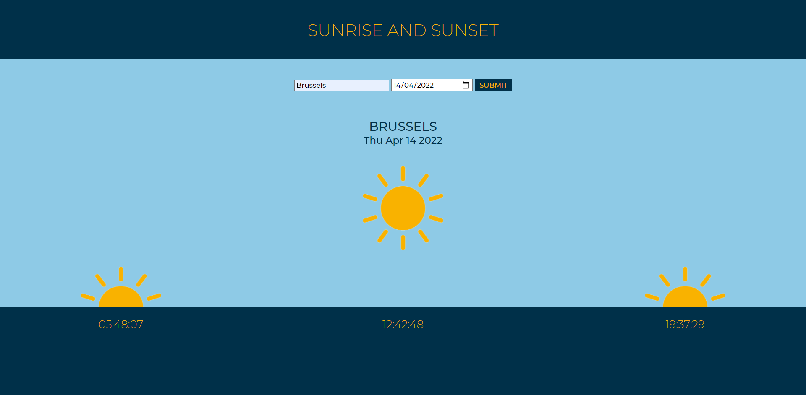
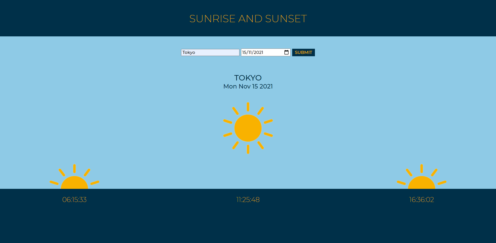
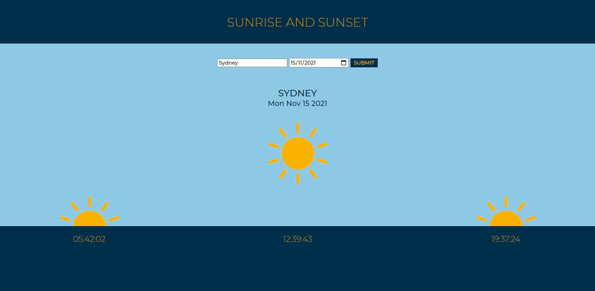

# Sunrise and Sunset Calculator (NOTE - Restricted access to the APIs)

Calculates the sunrise, solar noon and sunset of a chosen location on a given date. The latitude and longitude of the location are found using this [Geocode API](https://geocode.xyz/api). This information is then used to find the sunrise, solar noon and sunset from the [Sunrise Sunset API](https://sunrise-sunset.org/api). The [GeoNames API](http://www.geonames.org/export/web-services.html) is then used to find the timezone offset, so that the initial UTC times can be converted to the local times.

- *Note - There is restricted access to the APIs so extended waiting times between submissions may be necessary if times are undefined/NaN*

## Previews

#### Brussels in April

#### Tokyo in November

#### Sydney in November
